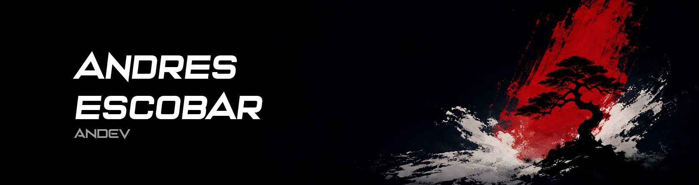

<h3 align="center">Web Developer · Full-stack en formación · Creative Development</h3>

  Desarrollo aplicaciones web modernas combinando frontend, backend y experiencias interactivas.

  
  

## Sobre mí

Soy **Andres**, estudiante de Informática en la Universidad Mayor de San Andrés y desarrollador web en formación.

Construyo aplicaciones utilizando tecnologías frontend y backend, trabajando también con autenticación, bases de datos y sistemas en tiempo real. Actualmente estoy ampliando mis conocimientos en animación, gráficos 3D y experiencias interactivas para la web.

Comparto mi trabajo bajo el nombre **Andev**, nacido de la combinación de *Andres + Developer*.

## Tecnologías

### Desarrollo web

  
  
  
  
  
  

### Backend y bases de datos

  
  
  
  
  
  
  
  

### Herramientas y desarrollo creativo

  
  
  
  
  

---

## Formación

Mi formación combina estudios universitarios en **Informática con mención en Desarrollo de Software** en la Universidad Mayor de San Andrés, cursos de **Cisco Networking Academy** y formación complementaria en plataformas como **Udemy** y **Código Facilito**.

Complemento esta formación mediante proyectos académicos, desarrollo colaborativo, hackathons y aprendizaje práctico de nuevas tecnologías.

---

## Participación

* Segundo lugar en la categoría B del Hackathon Byte Back 2026 con SecureMe.
* Participación en el Datatón 2025 de la Alcaldía de La Paz.
* Desarrollo de proyectos web, sistemas en tiempo real y experiencias interactivas.

---

## Actividad

  

---
## Contacto

  
  

  Diseñado y construido por Andev.

